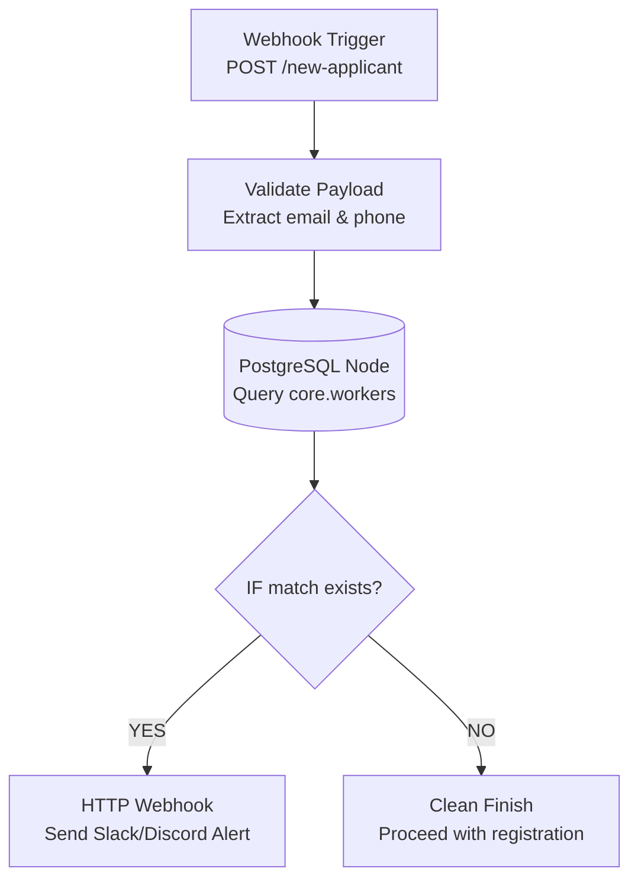

# Task 2: Automation (n8n Duplicate Checker)

## 1. Automation Architecture
This automation fulfills the Task 2 requirement of receiving a payload natively, running a duplicate query dynamically against the PostgreSQL Core database, and broadcasting alerts natively if a collision is found.



## 2. Trigger
**Type**: n8n Webhook Node
**Method**: `POST`
**Test Endpoint Example**: `http://localhost:5678/webhook-test/new-applicant`
**Expected Payload**:
```json
{
  "name": "Jane Doe",
  "email": "jane.doe@example.com",
  "phone_10": "9000000295"
}
```

## 3. Data-Processing Steps
The core pipeline executes these discrete steps:
1. **Webhook Listener**: Exposes a real-time internet-facing trigger endpoint.
2. **Postgres Node Execution**: Using parameterized binding `$1` and `$2`, queries the master database. 
3. **If Logic Router**: Analyzes the length of the returned array object.
4. **Alert Sender**: Dispatches a duplicate message downstream describing the collision.

## 4. PostgreSQL Integration
The connection is established using n8n's native `Postgres` credentials manager configuration:
```
Host: localhost
Database: consultbae
User: consultbae_app
Port: 5432
```
**Node Configuration (Parameterized for safety):**
```sql
SELECT worker_id, canonical_name 
FROM core.workers 
WHERE email = $1 OR phone_10 = $2
LIMIT 1;
```
Query Parameters bound dynamically:
`{{ $json.body.email }}, {{ $json.body.phone_10 }}`

## 5. Error Handling
- **Database Connection Failure**: Built-in n8n retry configuration (Retry on Fail = True).
- **Malformed Webhook Payload**: Falls back safely since variables will evaluate to null. The SQL parameter `$1` simply resolves false rather than causing a crash/SQL injection.
- **Null Safety**: If either parameter is missing, n8n binds it gracefully as empty text without syntax breaking.

## 6. Duplicate / Idempotency Handling
This entire workflow is explicitly designed as an **idempotent check**. It doesn't write new state. It strictly performs a `READ` on the database to isolate duplicates before saving. Because it makes no writes, calling it 1,000 times has the exact same side effects (zero) as calling it once.

## 7. Logging
n8n natively maintains full Execution Logs inside its GUI. Every execution path (YES or NO) is permanently recorded with the snapshot of the PostgreSQL payload returned.

## 8. Success / Failure Notification
The "Failure" logic (detecting a duplicate) triggers the **HTTP Request Node**.
**Method**: POST
**Endpoint**: *(Your webhook URL for Discord/Slack)*
**Body**:
```json
{
  "content": "🚨 DUPLICATE DETECTED: Worker {{$json.body.email}} already exists in the system under ID {{$node[\"Postgres Node\"].json[\"worker_id\"]}}."
}
```

## 9. Deliverables Required for Video Submission
For the final Loom submission video, ensure you capture:
1. Hitting the n8n webhook via `Postman` or `curl`.
2. The n8n canvas lighting up with green execution paths.
3. The Slack/Discord alert appearing.
4. Explaining that the query uses parameterized binding against the true PostgreSQL Core schema we built earlier.

## 10. Reproducible Setup Procedure
To run this automation immediately:
1. Ensure your PostgreSQL container/service is running the `consultbae` database.
2. Run `npx n8n` from your terminal.
3. Open `http://localhost:5678`.
4. Import `task2_duplicate_alert.json`.
5. Add your PostgreSQL credentials. 
6. Click "Execute Workflow" and ping your webhook.
